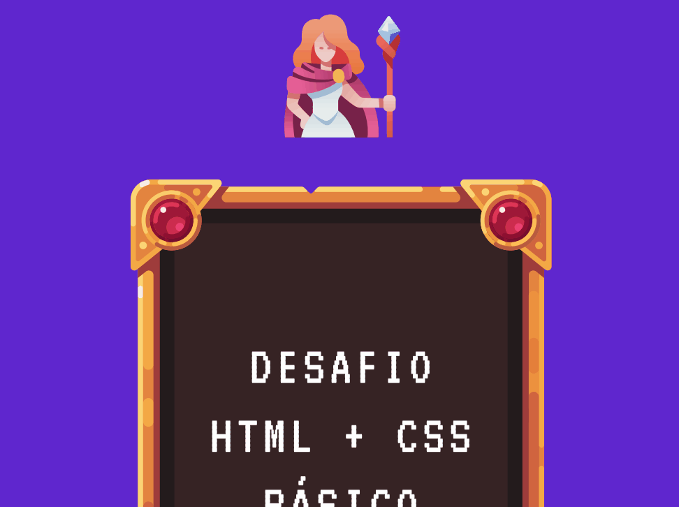

# Desafio-HTML-CSS-Básico
Desafio proposto no curso DevQuest para criar uma tabela estilizada, aplicando o aprendizado em HTML e CSS adquirido até essa etapa do curso.



## Tecnologias Utilizadas
```
- HTML
- CSS
```


